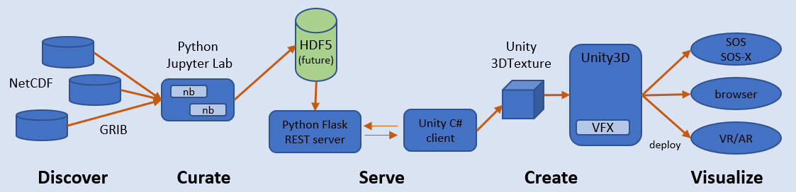

# Useful Information-Rich Force Field Visualizations for Geo-Science

Goal is to create information-rich visualizations for geo-science that have meaningful and useful interpretations for scientists and educators. To accomplish this goal, new features in Unity3D are leveraged to utilize GPU power for complex particle systems, with a focus on 3D vector force fields (VFF). By creating a volume having UVW vectors at each point, we can inject particles into this volume and watch the dynamics. An analogy is a pin-ball machine, whose mechanisms supply the dynamics that effect ordinary balls. 

The architecture converts [NetCDF](https://www.unidata.ucar.edu/software/netcdf/) & [GRIB](https://en.wikipedia.org/wiki/GRIB) datasets into force vector fields for rendering as [3DTextures](https://docs.unity3d.com/Manual/class-Texture3D.html) in [Unity Visual Effect Graphs](https://unity.com/visual-effect-graph). This architecture consists of the following pipeline:

* **Stage 1 -- Discover** - Find NetCDF or GRIB datasets that contain 3D vector fields (3D space with U-V-W values at each point) that are vital to geo-science research and education. 
* **Stage 2 -- Curate** - Prepare Store curated vector fields into library to be used by Server. 
* **Stage 3 -- Serve** - Construct REST web API to serve data to C# client within the Unity environment. 
* **Stage 4 -- Create** - Create Unity 3DTexture asset to be used in a Shader to be applied to a Material of a Gameobject. This can be accomplished either during Play dynamically or in the Editor for a static asset. 
* **Stage 5 -- Visualize** - Use 3DTesture as force field as property within VFX graph block, which has meaningful interpretations. 

Issues to be resolved:

* Mapping dataset dims to 3DTexture dims
* Specifying slices of the dataset dims to the server
* Managing a library of datasets to be visualized
* Bringing the real-world interpretation of dims into Unity viz
* Varying the VFX graph to show different aspects of the UVW field
* Rigging camera to best visualize the UVW rendering

# NetCDF to 3D Volume Textures

The goal is to convert [NetCDF](https://www.unidata.ucar.edu/software/netcdf/) & [GRIB](https://en.wikipedia.org/wiki/GRIB) datasets into force vector fields for rendering as [3DTextures](https://docs.unity3d.com/Manual/class-Texture3D.html) in [Unity Visual Effect Graphs](https://unity.com/visual-effect-graph). 

Specific functions include:

- Exploring the characteristics of NetDCDF/GRIB datasets
- ...

# Documentation

to be completed

# Installation using Conda

**NOTE:** Use conda, not pip, with a new environment created with `environment.yml` file

**To use notebooks**, install the following...
- [**JupyterLab**](https://jupyterlab.readthedocs.io/en/stable/getting_started/installation.html): 
Should also work under Notebook
- [**NetCDF4**](https://github.com/Unidata/netcdf4-python):
DO not use PIP. Install using Conda-Forge at [link](https://github.com/conda-forge/netcdf4-feedstock)
- [**ipyvolume**](https://github.com/maartenbreddels/ipyvolume): 
Will require nodejs, threejs, and more. Enable extension manually. 

**To use REST web API**, install the following...
- [**NetCDF4**](https://github.com/Unidata/netcdf4-python):
Do not use PIP. Install using Conda-Forge at [link](https://github.com/conda-forge/netcdf4-feedstock)
- [**Flask**](https://flask.palletsprojects.com/en/1.1.x/): 
Follow instructions carefully. Not your normal Python. But lots of instructional tutorials available. 
